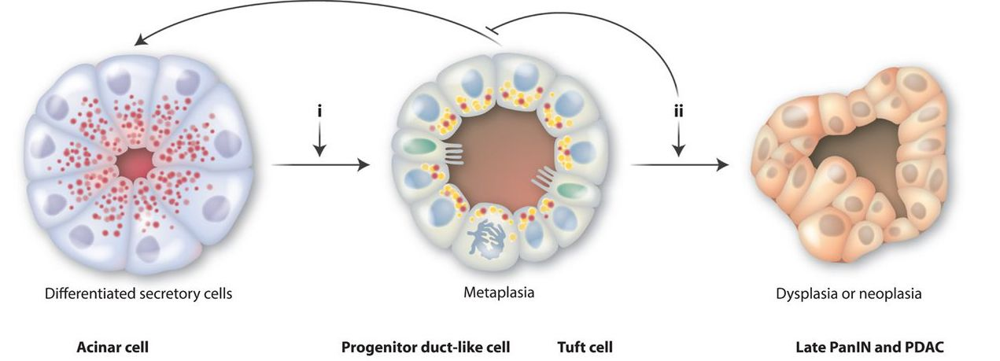
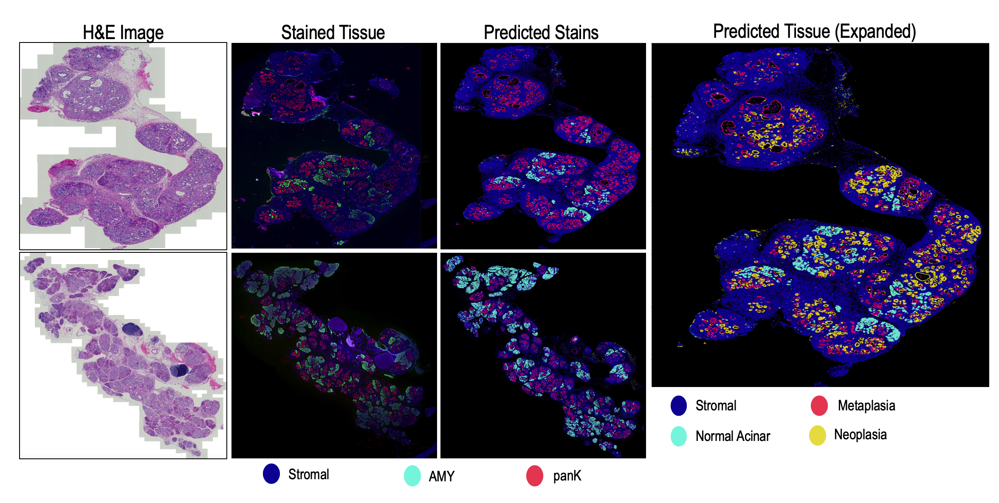
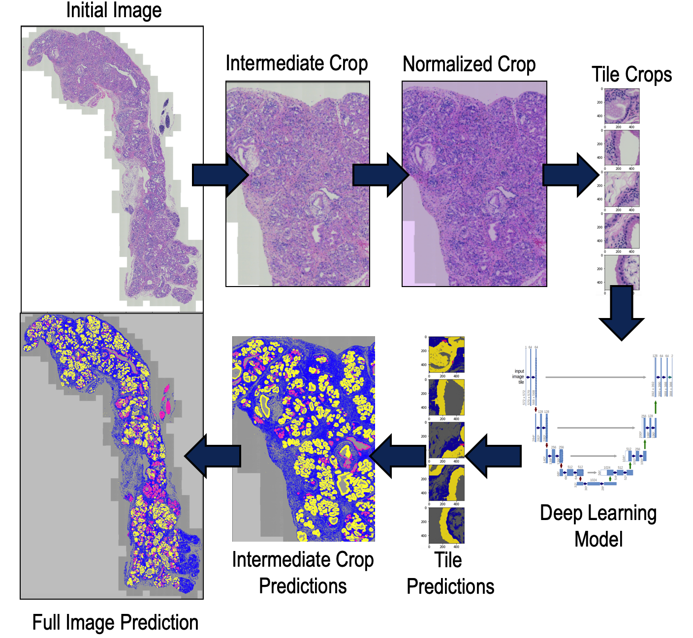

# Segmentation of Developing Cancer Morphologies in Mouse Pancreas
##Introduction
This is an image analysis pipeline that takes input H&E images of a mouse pancreas and determines the location and abundance of tissue types common in developing pancreatic cancer. The predicted tissues can both replicate immunostaining techniques, and can even discern morphologies that are inseperable with current stains.

<p align='center'>
  
  [1]
</p> 

<p align='center'>
  
</p>

## Method
This pipeline uses a stack of already trained UNet models [2] to predict tissue type based on morphology. Prior to UNet analysis, the H&E Images are locally normalized at intermediate crops using the Reinhard method [3]. Predictions for neoplasias, metaplasias, normal acinars, and stromal tissues are then combined to produce comprehensive results for an entire tissue.

<p align='center'>
  
</p>

## Prerequisites
- Linux or macOS
- NVIDIA GPU (memory suitable for image size) + CUDA cuDNN
- Tested on Python 3.7.3

## Necessary Packages
Tested using the following package versions:
- keras v. 2.2.4
- tensorflow v. 1.13.1
- staintools v. 2.1.2
- numpy v. 1.16.4
- Pillow v. 5.4.1
- OpenCV v. 4.1.0
- scikit-image v. 0.15.0
- tifffile v. 2019.7.26

## Using the Pipeline
- Copy H&E images of mouse pancereas with developing cancer into the "Inputs" folder (.tif format)
- From the command line, run the python script
```bash
python ProcessImages.py
```
- Predicted tissue masks and combined image will be saved into the "Outputs" folder (.tif format)

## Acknowledgements
1: Mills, J. C., & Sansom, O. J. (2015). Reserve stem cells: Differentiated cells reprogram to fuel repair, metaplasia, and neoplasia in the adult gastrointestinal tract. Science Signaling, 8(385). doi: 10.1126/scisignal.aaa7540

2: Ronneberger, O., Fischer, P., & Brox, T. (2015). U-Net: Convolutional Networks for Biomedical Image Segmentation. ArXiv, abs/1505.04597. 

3: Reinhard, E., Ashikhmin, M., Gooch, B., & Shirley, P. (2001). Color Transfer between Images. IEEE Computer Graphics and Applications, 21, 34-41


